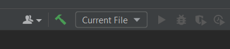
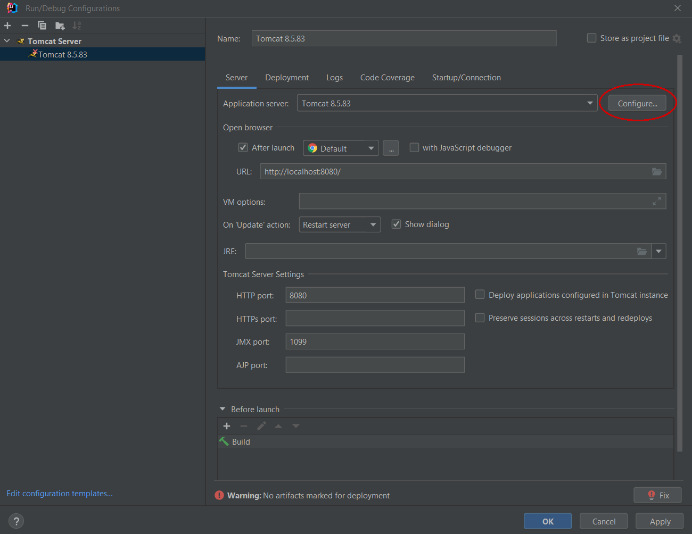
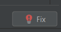

# Warehouse Application
## ✒ Description
Warehouse Application is an application which has a lot of useful functionality that will helps you manage your warehouse, it is based on N-tier architecture and principles of OOP and SOLID. The application supports all CRUD operations. This solution will allow you to easily use all the features of this application.
## 🛠️ How to Install and Run the Project
1. Install JDK v11 or later
2. Clone this project to your JDK
3. Install PostgreSQL v14 or later
4. Configure [db.properties](src/main/resources/db.properties) file
5. Install Apache Tomcat v8.5.83 or later
6. [Configure Apache Tomcat in JDK](#configure-apache-tomcat)
7. Click on debug on the toolbar to use the application
8. ## 👩‍💻 Technologies
Application based on Spring Framework v5.3.17
### **Web**
* Apache Tomcat v8.5.83 as servlet
* Javax Servlet API v4.0.1
* Spring MVC
### **Database**
* PostgreSQL v.42.4.0
* JDBS driver for PostgreSQL connector
### **Enviroments**
* pgAdmin 4
* IntelliJ IDEA
### **Others**
* Apache Maven as application builder
* Hibernate ORM v5.4.27.Final
* Apache commons v2.8.0
## 🍩 Features
This app provides you with a lot of useful functionality, you can:
* Add new warehouse/unit/nomenclature/material to warehouse
* Change warehouse/unit/nomenclature/material properties
* Get warehouse/unit/nomenclature/material from warehouse (all or by id)
* Delete warehouse/unit/nomenclature/material from warehouse
* Get material by unit or nomenclature
## 📑 Project structure
The project is based on the N-tier architecture, which also follows the principles of SOLID, which provides:
* service layer
* DAO layer
* Database
## Configure Apache Tomcat
1. On the toolbar, select Current File -> Edit Configurations

2. Add Apache Tomcat - Local
3. Click on Configure and choose the path to installed Apache Tomcat

4. Click on Fix

Select **project-name:war-exploded**

5. Delete text from Application context

Just leave it empty

6. Click OK
